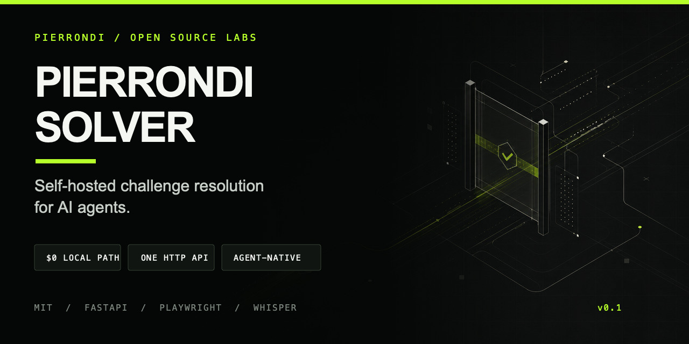
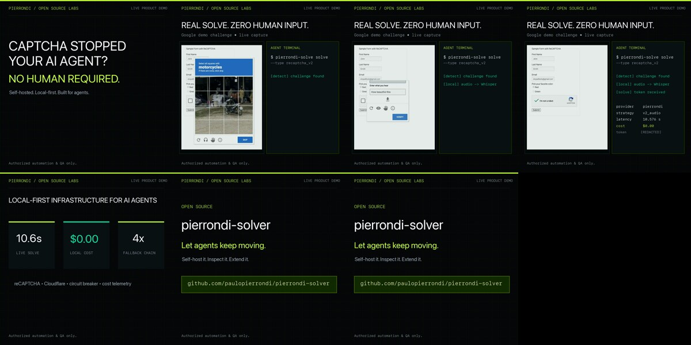
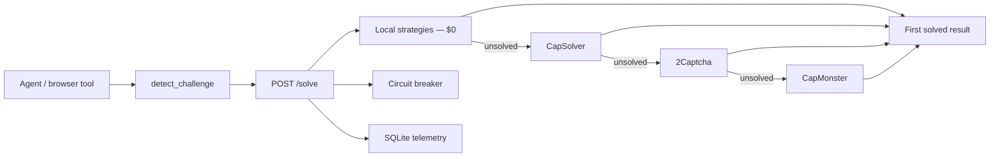

<p align="center">
  
</p>

<p align="center">
  <strong>The local-first verification layer for authorized AI-agent workflows.</strong><br>
  One HTTP API for reCAPTCHA v2/v3, hCaptcha, Turnstile and Cloudflare clearance — local $0 first, commercial failover, proxy identity, MCP tools, and typed clients.
</p>

<p align="center">
  <a href="https://github.com/paulopierrondi/pierrondi-solver/actions/workflows/ci.yml"></a>
  
  <a href="LICENSE"></a>
  
  
</p>

<p align="center">
  <a href="#quickstart">Quickstart</a> ·
  <a href="#watch-a-real-solve">Live proof</a> ·
  <a href="docs/ARCHITECTURE.md">Architecture</a> ·
  <a href="COMPARISON.md">Comparison</a> ·
  <a href="docs/BRAND.md">Brand system</a>
</p>

---

## Agents should not stop at verification walls

A long-running agent can browse, call tools, and recover from API failures—then
lose the entire run when a CAPTCHA or Cloudflare interstitial appears.
`pierrondi-solver` turns that interruption into infrastructure:

1. detect the challenge;
2. try the local `$0` path;
3. fail over through configured commercial providers;
4. isolate degraded providers;
5. return a token or a structured reason;
6. record success, latency, and approximate cost.

No provider-specific logic leaks into the agent.

| Local-first | One contract | Resilient | Observable |
| --- | --- | --- | --- |
| Audio + Whisper and Chromium clearance paths | `POST /solve` for every supported challenge | Cascade plus per-provider circuit breaker | SQLite metrics without storing raw tokens |

## Watch a real solve

<a href="https://x.com/paulopierrondi/status/2080296081775030700">
  
</a>

The launch demo records a real Google reCAPTCHA v2 challenge resolved locally
in **10.6 seconds** at **$0.00 local provider cost**. The demo and the repository
are separate proof surfaces: the video shows the product working; the tests show
the contracts remain stable.

> [Watch the full product demo on X →](https://x.com/paulopierrondi/status/2080296081775030700)

## Quickstart

### Full local path

```bash
git clone https://github.com/paulopierrondi/pierrondi-solver.git
cd pierrondi-solver

python3.11 -m venv .venv
source .venv/bin/activate
pip install -e '.[dev,local-solve]'
playwright install chromium

uvicorn pierrondi_solver.main:app --port 8791 --app-dir src
```

In another terminal:

```bash
pierrondi-solve doctor
pierrondi-solve health
```

### First request

```bash
curl -s http://127.0.0.1:8791/solve \
  -H 'content-type: application/json' \
  -d '{
    "type": "recaptcha_v2",
    "sitekey": "YOUR_AUTHORIZED_TEST_SITEKEY",
    "page_url": "https://your-authorized-test-page.example",
    "lane": "default",
    "purpose": "read_only",
    "operation_id": "availability-check-42",
    "attempt": 1
  }'
```

Success:

```json
{
  "token": "…",
  "strategy": "v2_audio",
  "provider": "pierrondi",
  "latency_ms": 10600,
  "cost_usd": 0.0,
  "extra": {
    "artifact_policy": {
      "purpose": "read_only",
      "operation_id": "availability-check-42",
      "attempt": 1,
      "consumption": "single_use",
      "must_not_reuse_across_purposes": true
    }
  }
}
```

`purpose` makes the consumption boundary explicit:

- `authentication` — login or session establishment;
- `read_only` — a check that must not change remote state;
- `state_change` — a separately authorized action;
- `generic` — backward-compatible default.

For token-based challenges, request a fresh solve when the purpose changes.
Cloudflare clearance is instead marked `session_bound`: cookie, user agent,
and originating IP must remain together. `operation_id` must be an opaque,
non-secret identifier; telemetry stores only its hash.

Unsolved paths remain inspectable:

```json
{
  "error": "unsolved",
  "reason": "pierrondi/v2_audio: audio_unavailable; capsolver: no_api_key",
  "fallback_recommended": true,
  "attempts": ["…"]
}
```

## What it handles

| Challenge | Local path | Commercial fallback | Current behavior |
| --- | --- | --- | --- |
| reCAPTCHA v2 | Audio challenge → `faster-whisper` on CPU; **image-tile via pluggable vision classifier** (`register_classifier`) | CapSolver, 2Captcha, CapMonster | Live-validated |
| Cloudflare interstitial / IUAM | Stealth Chromium, Firefox, nodriver, **or camoufox** (hardened Firefox) harvests `cf_clearance` + user agent | CapSolver `AntiCloudflareTask` with proxy | Live-validated |
| Turnstile | Stealth Chromium harvests `cf-turnstile-response` | CapSolver, 2Captcha, CapMonster | Live-validated |
| hCaptcha | **Accessibility cookie → audio challenge → `faster-whisper`** | CapSolver, 2Captcha, CapMonster | Local path wired |
| reCAPTCHA v3 | Stealth Chromium executes `grecaptcha.execute` and returns the real token (score caveat in `extra.score_note`) | CapSolver, 2Captcha, CapMonster | Live-validated |

The image-tile strategy is an explicit stub. It cannot fail silently or pretend
to support a path that is not implemented.

## Passive WAF detection

`pierrondi_solver.waf` classifies the protection present on a page from
passive signals (body/headers) and routes it: Cloudflare → the solver's own
clearance path; DataDome, Queue-it, PerimeterX/HUMAN, Akamai → `stop`.
Detection never means evasion.

## Clients

- **Go**: `clients/go` — typed `solverclient` with local validation,
  artifact-policy enforcement, bounded reads, redacted errors and zero
  implicit retry.
- **Live battery**: `examples/solve_matrix.sh` runs v2/v3/hcaptcha/turnstile
  against the providers' official demo pages.

## How the cascade works



The default provider order is:

```text
pierrondi → capsolver → 2captcha → capmonster
```

A provider is skipped when its circuit is open. Missing keys, missing optional
dependencies, and explicit stubs do not burn breaker budget.

Read the full [architecture and failure model](docs/ARCHITECTURE.md).

## Agent-native interfaces

### CLI

```bash
# detect a challenge in captured HTML
pierrondi-solve detect \
  --html-file page.html \
  --url https://your-authorized-test-page.example

# request a solve
pierrondi-solve solve \
  --type recaptcha_v2 \
  --sitekey YOUR_AUTHORIZED_TEST_SITEKEY \
  --url https://your-authorized-test-page.example

# audit service, dependencies, browser, and configuration
pierrondi-solve doctor
```

### Python

```python
from pierrondi_solver.client import Challenge, solve_verbose

result = solve_verbose(
    Challenge("cloudflare", "", "https://your-authorized-property.example")
)

if result["solved"]:
    cookie = result["extra"]["cookies"]["cf_clearance"]
    user_agent = result["extra"]["user_agent"]
    # Reuse cookie + user agent from the same IP.
```

### Claude Code hook

[`hooks/captcha_posttool_hook.py`](hooks/captcha_posttool_hook.py) is a
`PostToolUse` hook for browser-like tool output. It detects known markers,
extracts a sitekey when available, and gives the agent a structured instruction
to resolve the interruption without interrupting the operator.

See the [hook setup example](examples/claude-code-hook.md).

### MCP server (Codex, Gemini, Antigravity, Claude Code)

The official MCP server exposes the solver as native tools so any MCP-compatible
agent or coder can detect and solve challenges without pasting solver code.

```bash
pip install -e '.[mcp]'
pierrondi-solver-mcp   # stdio server
```

Tools: `solve_challenge`, `detect_challenge`, `get_browser_session`,
`service_health`, `service_doctor`. Point any MCP client at the command above.
Full setup and client config: [docs/MCP_SERVER.md](docs/MCP_SERVER.md).

## API

| Method | Route | Purpose |
| --- | --- | --- |
| `GET` | `/health` | Service status and configured provider order |
| `GET` | `/metrics?window_s=86400` | Success, latency, and cost by provider |
| `POST` | `/solve` | Typed challenge request and first-success result |

Cloudflare interstitials have no sitekey. Their successful response includes:

```json
{
  "extra": {
    "cookies": {"cf_clearance": "…"},
    "user_agent": "…"
  }
}
```

The cookie, user agent, and originating IP are a single clearance context.

## Proxy and identity

Cloudflare clearance, Turnstile and reCAPTCHA v3 harvests all honor the
proxy layer: set `SOLVER_PROXY` (static), or `SOLVER_PROXY_ENDPOINT`
(rotating, or sticky with `SOLVER_PROXY_STICKY=1`) and the browser egress IP
is the proxy's, not the host's. When a proxy is configured but unavailable,
the strategies fail closed (`deps_missing: proxy_unavailable`) rather than
silently solving from the host IP. Result metadata carries only an 8-char
fingerprint of the connect string — never the value.

For Turnstile/v3 a residential proxy mainly buys IP reputation; for
Cloudflare it is what makes `cf_clearance` reusable (cookie + user agent +
IP are one identity).

## Observability by default

Every runnable attempt records:

- provider and strategy;
- challenge type and site host;
- lane;
- semantic purpose and a hash of the optional operation ID;
- success;
- latency;
- approximate USD cost;
- structured reason;
- a 12-character SHA-256 token fingerprint.

Raw tokens are not stored.

```bash
curl -s 'http://127.0.0.1:8791/metrics?window_s=86400'
```

```json
{
  "window_s": 86400,
  "attempts": 12,
  "solved": 10,
  "by_provider": {
    "pierrondi": {
      "attempts": 9,
      "solved": 8,
      "cost_usd": 0.0,
      "avg_latency_ms": 11820,
      "success_rate": 0.8889
    }
  }
}
```

## Configuration

Secrets are environment-only. The repository stores names and instructions,
never values.

| Variable | Default | Purpose |
| --- | --- | --- |
| `PIERRONDI_SOLVER_URL` | `http://127.0.0.1:8791` | Client endpoint |
| `PIERRONDI_SOLVER_DB` | `data/telemetry.db` | SQLite telemetry path |
| `CAPTCHA_PROVIDER` | `auto` | Use the cascade or pin one provider |
| `CAPSOLVER_API_KEY` | — | CapSolver fallback |
| `TWOCAPTCHA_API_KEY` | — | 2Captcha fallback |
| `CAPMONSTER_API_KEY` | — | CapMonster fallback |
| `CAPSOLVER_PROXY` | — | Proxy required for CapSolver Cloudflare tasks |
| `SOLVER_BREAKER_FAILURE_RATE` | `0.30` | Breaker threshold |
| `SOLVER_BREAKER_MIN_SAMPLES` | `5` | Samples before opening |
| `SOLVER_BREAKER_WINDOW_S` | `3600` | Sliding window |
| `SOLVER_BROWSER_ENGINE` | `nodriver` | Silent local clearance engine (`nodriver`, `chromium`, `firefox`, `camoufox`) |
| `SOLVER_PROXY` | — | Proxy connect string for clearance and token harvests (Cloudflare, Turnstile, reCAPTCHA v3 bind to a controlled IP) |
| `SOLVER_PROXY_ENDPOINT` | — | Rotating/sticky proxy provider endpoint (residential) |
| `SOLVER_PROXY_STICKY` | — | `1` to cache proxy per session key within `SOLVER_PROXY_STICKY_TTL` |
| `SOLVER_PROXY_STICKY_TTL` | `600` | Sticky proxy lifetime in seconds |
| `HCAPTCHA_ACCESSIBILITY_COOKIE` | — | Enables the hCaptcha local audio path |

Read [Getting provider keys](docs/GETTING_KEYS.md) without placing them in the
repository.

## Test suite

```bash
pip install -e '.[dev]'
pytest -q
```

The suite covers the API contract, provider chain, breaker, telemetry, client,
challenge detection, hook, Cloudflare handling, commercial adapters, and
`doctor`. Live browser/network solves use the `live` marker and stay outside CI.

## Documentation

| Document | Read it for |
| --- | --- |
| [Architecture](docs/ARCHITECTURE.md) | Flow, components, data handling, failure model |
| [MCP server](docs/MCP_SERVER.md) | Expose the solver as tools to any MCP-compatible agent/coder |
| [Getting keys](docs/GETTING_KEYS.md) | Commercial provider setup |
| [Comparison](COMPARISON.md) | Trade-offs against focused alternatives |
| [Brand system](docs/BRAND.md) | `PIERRONDI / LABS` visual and verbal identity |
| [GitHub profile kit](docs/GITHUB_PROFILE.md) | Copy-ready portfolio profile and repo standard |
| [Contributing](CONTRIBUTING.md) | Development and contribution contract |
| [Security](SECURITY.md) | Private reporting and security properties |
| [Support](SUPPORT.md) | Diagnostics and safe issue reporting |
| [Changelog](CHANGELOG.md) | Version history |

## Responsible use

This project is for accounts, properties, QA environments, and automation flows
you own or are explicitly authorized to operate.

Do not use it for:

- third-party targets without authorization;
- mass account creation;
- credential abuse;
- login-wall or 2FA bypass;
- fingerprint evasion or anti-ban systems;
- any workflow that violates applicable law or a target's Terms of Service.

Structured refusal and escalation are features, not missing polish.

## Contributing

Focused issues and pull requests are welcome. Start with
[`CONTRIBUTING.md`](CONTRIBUTING.md), use the issue forms, and keep examples
redacted.

Security-sensitive findings belong in
[private vulnerability reporting](https://github.com/paulopierrondi/pierrondi-solver/security/advisories/new).

## The maker system

`pierrondi-solver` is published under **PIERRONDI / OPEN SOURCE LABS**:

> Build systems. Ship products. Show the proof.

The full, reusable portfolio identity—naming, voice, colors, typography, asset
rules, and cross-product extension logic—is documented in
[`docs/BRAND.md`](docs/BRAND.md).

## License

MIT © Paulo Pierrondi. See [`LICENSE`](LICENSE).
