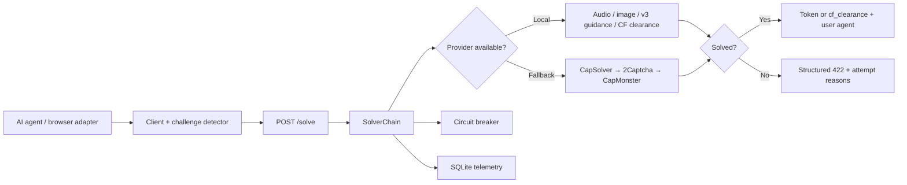
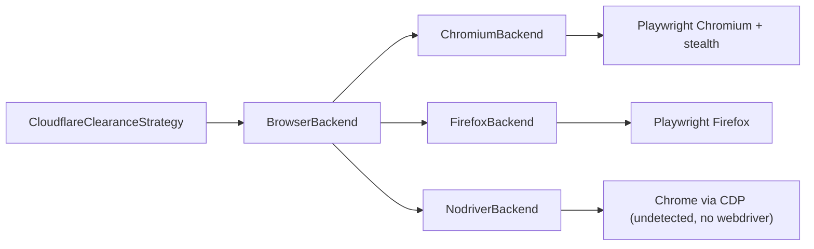

# Architecture

`pierrondi-solver` is a small, local-first HTTP service. Callers do not need to
know which strategy or provider ultimately handles a challenge.



## Components

| Component | Responsibility |
| --- | --- |
| `main.py` | FastAPI application and `/health`, `/metrics`, `/solve` routes |
| `client.py` | Challenge detection, Python client, CLI, and `doctor` audit |
| `mcp_server.py` | MCP server exposing solver as tools for any MCP-compatible agent/coder (Codex, Gemini, Antigravity, Claude Code) |
| `chain.py` | Ordered provider cascade and first-success result |
| `strategies/` | Local challenge-specific implementations (reCAPTCHA v2 audio/image, v3 guidance, hCaptcha audio, Cloudflare clearance) |
| `proxy.py` | Proxy / identity layer: `ProxyBackend` (static/rotating/sticky) + `IdentityContext` (binds UA + IP + cookie) |
| `browser/` | Engine-agnostic browser backend (`BrowserBackend`): Chromium, Firefox, nodriver (undetected Chrome via CDP), and camoufox (hardened Firefox) clearance harvesters, selectable via `SOLVER_BROWSER_ENGINE` |
| `providers/commercial.py` | Commercial fallback adapters |
| `circuit_breaker.py` | Sliding-window failure isolation per provider |
| `telemetry.py` | SQLite attempt log and provider-level metrics |
| `hooks/captcha_posttool_hook.py` | Claude Code PostToolUse challenge handoff |

## Solve lifecycle

1. A caller detects a supported challenge in HTML or sends a typed request.
2. `POST /solve` validates the request through Pydantic.
3. `SolverChain` evaluates providers in configured order.
4. An open circuit is skipped. Missing keys, missing dependencies, and explicit
   stubs are also skipped without burning breaker budget.
5. Every runnable attempt updates the breaker and telemetry.
6. The first successful outcome returns a token or Cloudflare clearance context
   plus an `artifact_policy` describing its intended purpose and consumption.
7. If all paths fail, the API returns HTTP `422` with structured attempt reasons.

The default order is:

```text
pierrondi (local) → capsolver → 2captcha → capmonster
```

Set `CAPTCHA_PROVIDER` to pin a single provider.

## Browser backends (multi-engine)

Local clearance strategies (Cloudflare interstitial today; local hCaptcha /
Turnstile in future slices) do not bind to a single browser engine. They depend
on a `BrowserBackend` interface and delegate the actual harvest to the selected
engine.



`SOLVER_BROWSER_ENGINE` selects the backend (`nodriver` default for silent,
webdriver-free runs; `chromium`, `firefox`, and `camoufox` are selectable). Each backend reports its optional dependencies via
`deps_missing()`; when the engine is unavailable the chain skips it without
burning breaker budget — the same convention used for provider API keys and
strategy stubs. The `engine` that produced a clearance is returned in
`extra.engine` for telemetry.

## Proxy / identity layer

Cloudflare clearance is bound to the IP that solved the challenge AND the
User-Agent presented. Without proxy control, clearance is single-use and tied to
the host IP — useless for multi-account or geo-diverse flows.

`ProxyBackend` (in `proxy.py`) resolves a proxy connect string for a given
lane/session:

| Backend | Env | Behavior |
| --- | --- | --- |
| `StaticProxyBackend` | `SOLVER_PROXY` | Single fixed proxy (may be None) |
| `RotatingProxyBackend` | `SOLVER_PROXY_ENDPOINT` | Fresh IP each call (residential) |
| `StickyProxyBackend` | `SOLVER_PROXY_ENDPOINT` + `SOLVER_PROXY_STICKY=1` | Same IP per session key within `SOLVER_PROXY_STICKY_TTL` |

`IdentityContext` makes the (UA + IP + cookie) binding explicit: a clearance is
only reusable when all three axes are consistent. Proxy credentials come from
env only; successful clearance metadata returns an 8-char hash of the connect
string for correlation, never the value. Proxy resolution fails closed when a
configured endpoint is unavailable. Chromium, Firefox, and camoufox support the
proxy path; nodriver currently reports `proxy_not_supported` rather than silently
harvesting on the host IP.

## Data handling

- Secret values are read from environment variables and are never written to
  repository files.
- Telemetry stores the site host, lane, latency, approximate cost, success, and
  a 12-character SHA-256 token fingerprint—not the token itself.
- Callers may add an opaque `operation_id` and semantic `purpose`
  (`authentication`, `read_only`, or `state_change`). Telemetry stores only the
  operation ID fingerprint and aggregates results by purpose.
- Token artifacts are marked `single_use` and must not cross purposes. A
  Cloudflare clearance is marked `session_bound` because its cookie, user agent,
  and IP form one identity context.
- Cloudflare clearance is bound to the originating user agent and IP. Callers
  must reuse both.
- Login walls and 2FA are outside the supported policy.

## Failure model

The breaker opens only after the configured minimum sample count and when the
failure rate exceeds the threshold inside the sliding time window. This prevents
a degraded commercial provider from slowing every agent while allowing
dependency/configuration skips to remain operational signals rather than false
provider failures.
